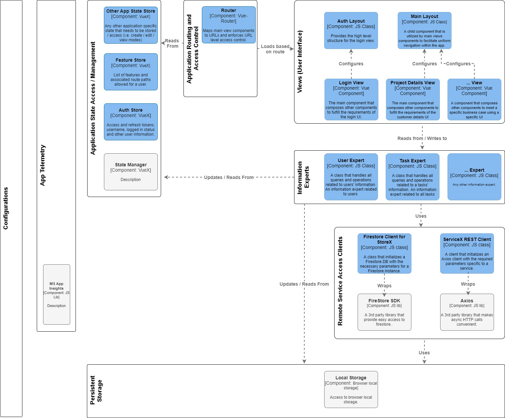

# Frontend Application Template with VueJS
The aim of this project is to provide a standard structure to a front end application. 

1. It dictates where different types of logic (i.e. API access, UIs, components) are placed within the the structure of the application.
    - All data retrieval and data related business logic handled by **information experts**
    - All remote service access (REST APIs, websocket connections, Firestore access) handled by **api clients**
    - All runtime configurations to be stored under /public/config.js
        - URLs
        - API keys
        - Log Levels
    - All reusable UI components / controllers to placed under **/src/components**
    - All views (full fledged screens (i.e. login UI, registration UI)) to be placed under **/src/views**
    - All application state management to be handled using VueX, located at **/src/store**
    - All persistence mechanisms such as cookies and browser storage to be placed under **/src/persistence**
    - All static assets such as images or videos to be stored under **/src/assets**
1. Provides ready integration with popular libraries that solve specific problems.
    - Axios for REST API access
    - Firestore SDK for Google Firestore access

## Architecture Diagram

